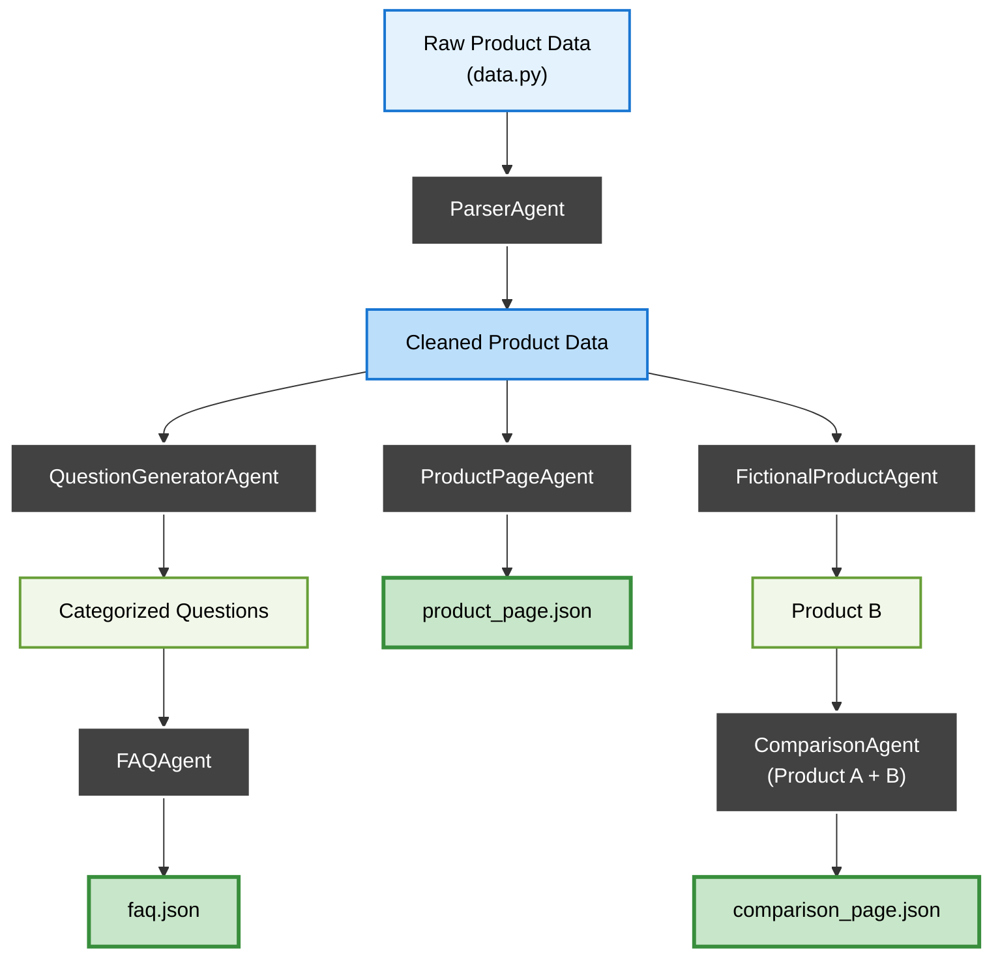

# Kasparro - Applied AI Engineer Challenge  
### 🚀 Multi-Agent Content Generation System 🚀


## Overview
A modular agentic automation system that takes a small product
dataset and automatically generates structured, machine-readable JSON content pages:

- `product_page.json` – Detailed product description
- `faq.json`         – FAQ page with ≥8 categorized Q&As
- `comparison_page.json` – Side-by-side comparison with a fictional Product B

## System Design Highlights

- **6 specialized agents** with single responsibilities and clear input/output
- **Orchestration** via a clean DAG-style pipeline in `main.py`
- **Reusable logic blocks** for content transformation (e.g., comparisons, answer generation)
- **Custom template engine** for consistent, machine-readable JSON output
- **Extensible structure** — easy to add new agents or templates


## Automation Flow (Orchestration Graph)


## How to Run:

```bash
python main.py
